[](https://www.nuget.org/packages/atc.wpf)

# ATC.Net WPF

This is a base libraries for building WPF application with the MVVM design pattern.

# Table of contents

- [ATC.Net WPF](#atcnet-wpf)
- [Table of contents](#table-of-contents)
  - [Requirements](#requirements)
  - [NuGet Packages Provided in this Repository](#nuget-packages-provided-in-this-repository)
  - [Demonstration Application](#demonstration-application)
    - [Playground and Viewer for a Given Control or Functionality](#playground-and-viewer-for-a-given-control-or-functionality)
    - [Initial glimpse at the demonstration application](#initial-glimpse-at-the-demonstration-application)
  - [How to get started with atc-wpf](#how-to-get-started-with-atc-wpf)
  - [MVVM](#mvvm)
  - [Translation](#translation)
  - [Media - ShaderEffects](#media---shadereffects)
  - [ValueConverters in Atc.Wpf](#valueconverters-in-atcwpf)
    - [ValueConverters - Bool to X](#valueconverters---bool-to-x)
    - [ValueConverters - String to X](#valueconverters---string-to-x)
    - [ValueConverters - ICollection to X](#valueconverters---icollection-to-x)
    - [ValueConverters - Object to X](#valueconverters---object-to-x)
    - [ValueConverters - Markup to X](#valueconverters---markup-to-x)
    - [ValueConverters - Others to X](#valueconverters---others-to-x)
    - [ValueConverters - Math](#valueconverters---math)
  - [ValueConverters in Atc.Wpf.FontIcons](#valueconverters-in-atcwpffonticons)
  - [ValueConverters in Atc.Wpf.Theming](#valueconverters-in-atcwpftheming)
  - [How to contribute](#how-to-contribute)

## Requirements

[.NET 8 - Desktop Runtime](https://dotnet.microsoft.com/en-us/download/dotnet/8.0)

## NuGet Packages Provided in this Repository

| Nuget package     | Description                                         | Dependencies              |
|-------------------|-----------------------------------------------------|---------------------------|
| Atc.Wpf           | Base Controls, ValueConverters, Extensions etc.     | Atc                       |
| Atc.FontIcons     | Render Svg and Img resources based on fonts         | Atc.Wpf                   |
| Atc.Theming       | Theming for Light & Dark mode for WPF base controls | Atc.Wpf                   |
| Atc.Controls      | Miscellaneous UI Controls                           | Atc.Wpf & Atc.Wpf.Theming |

## Demonstration Application

The demonstration application, `Atc.Wpf.Sample`, functions as a control explorer.
It provides quick visualization of a given control, along with options for
copying and pasting the XAML markup and/or the C# code for how to use it.

### Playground and Viewer for a Given Control or Functionality

The following example is taken from the ReplayCommandAsync which illustrates its usage:

- The `Sample` tab shows how to use the control or feature.
- The `XAML` tab displays the corresponding XAML markup.
- The `CodeBehind` tab reveals the underlying code-behind.
- The `ViewModel` tab displays the associated ViewModel, if used.

|                                                                         |                                                                       |
|-------------------------------------------------------------------------|-----------------------------------------------------------------------|
| Sample 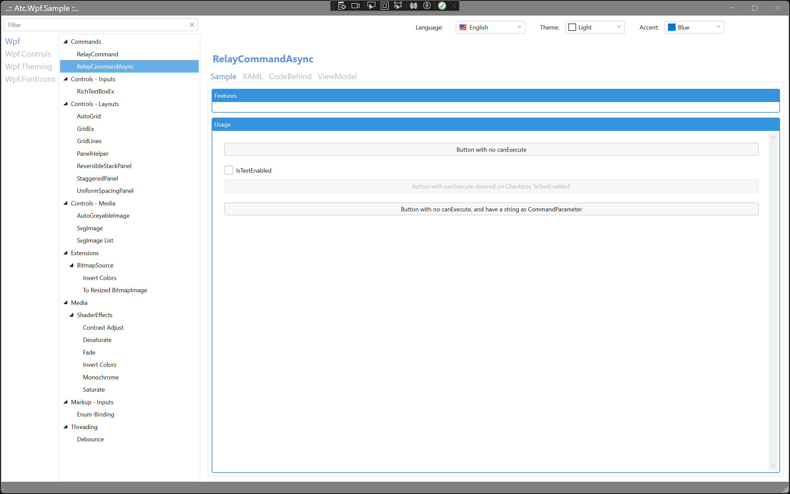         | XAML 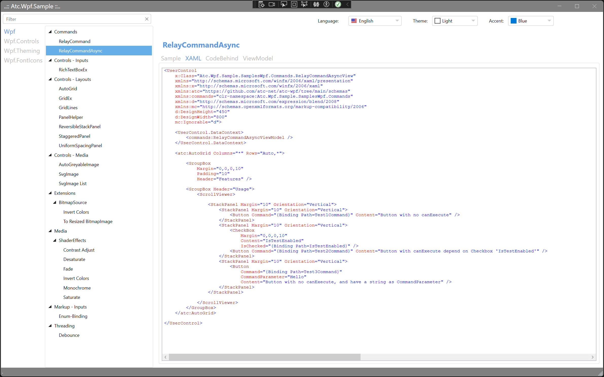           |
| CodeBehind 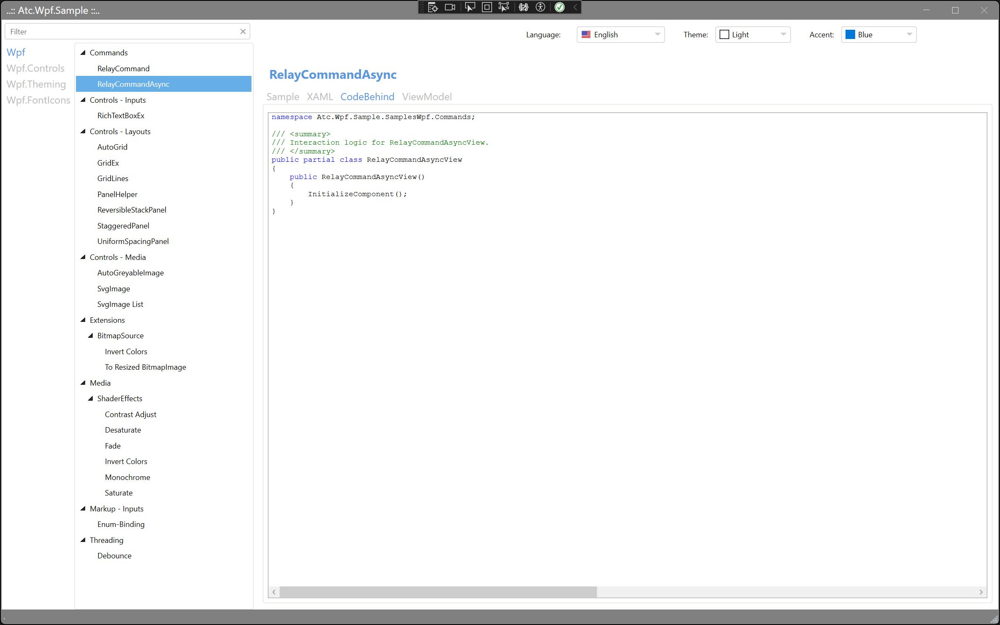 | ViewModel 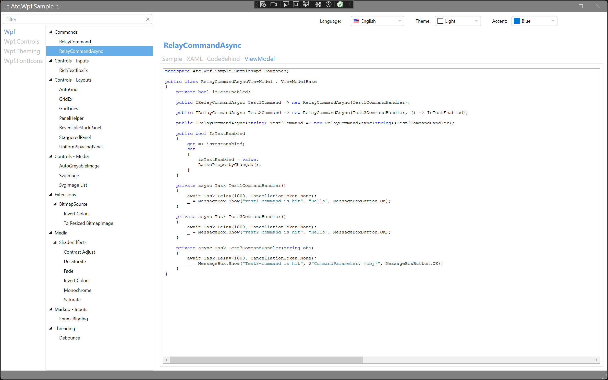 |

### Initial glimpse at the demonstration application

| Light-Mode                                                                   | Dark-Mode                                                                    |
|------------------------------------------------------------------------------|------------------------------------------------------------------------------|
| Wpf - AutoGrid 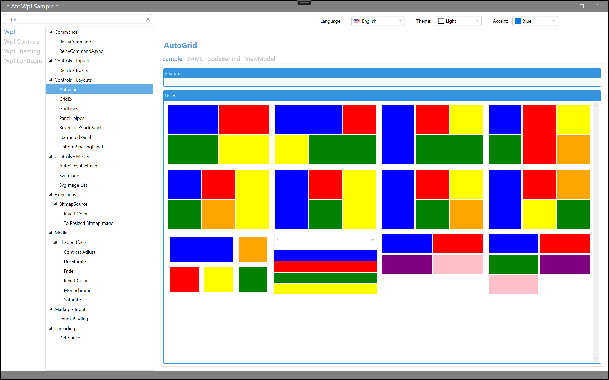                       | Wpf - AutoGrid 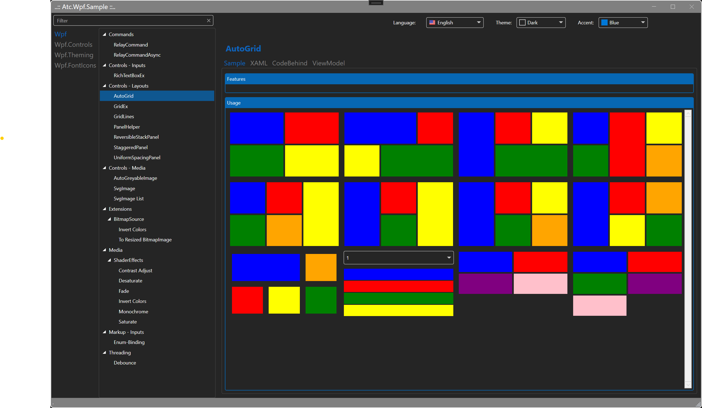                       |
| Wpf.Controls - Label MIX 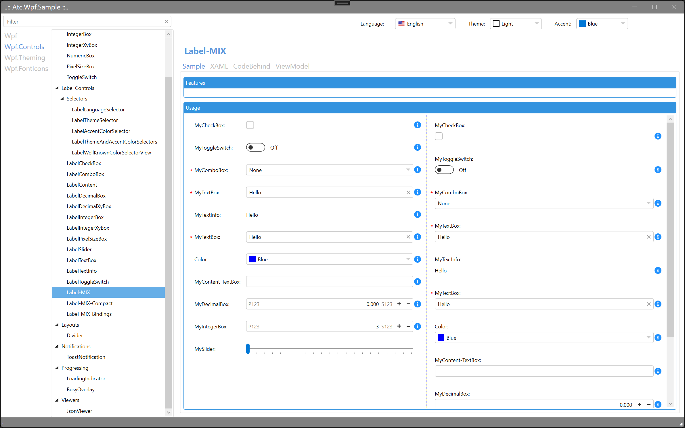   | Wpf.Controls - Label MIX 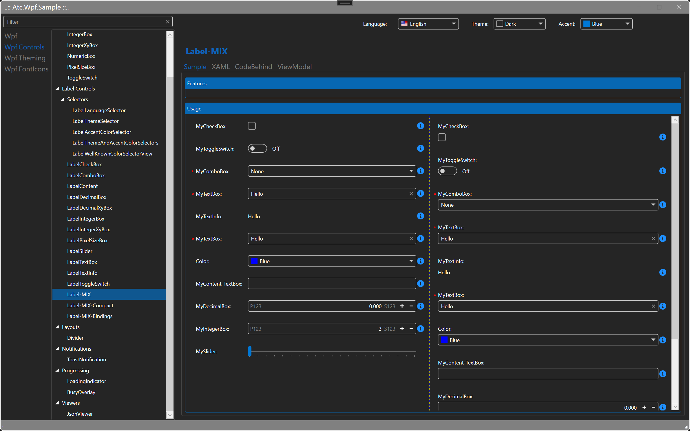   |
| Wpf.Theming - ImageButton 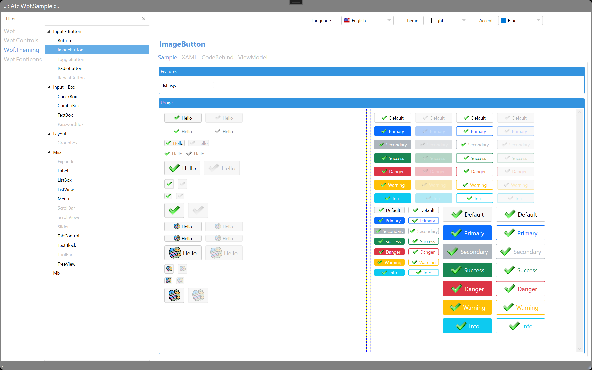 | Wpf.Theming - ImageButton 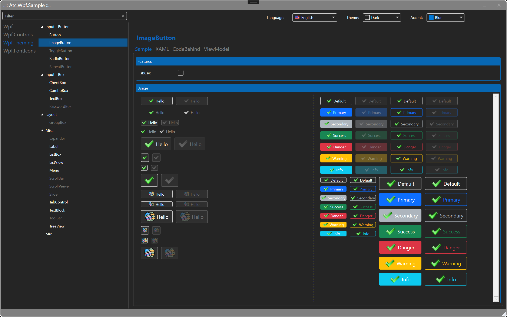 |
| Wpf.FontIcons - Viewer 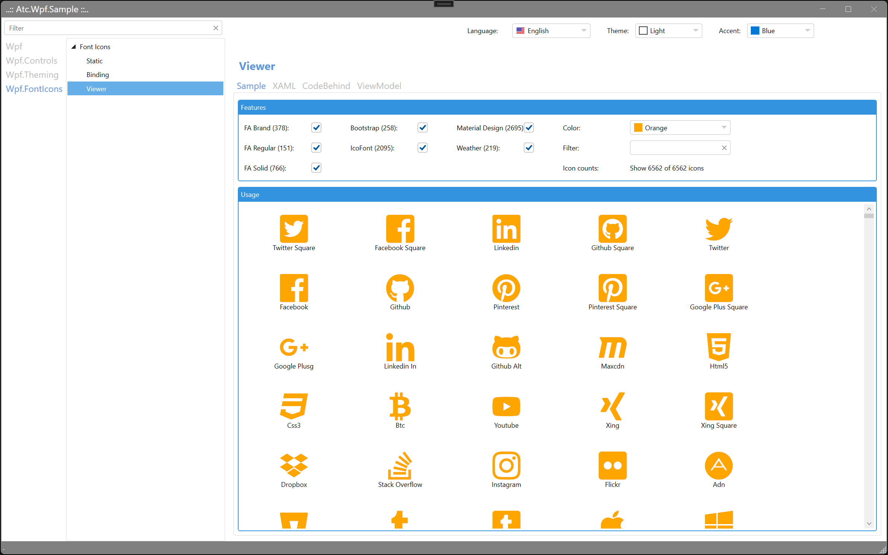        | Wpf.FontIcons - Viewer 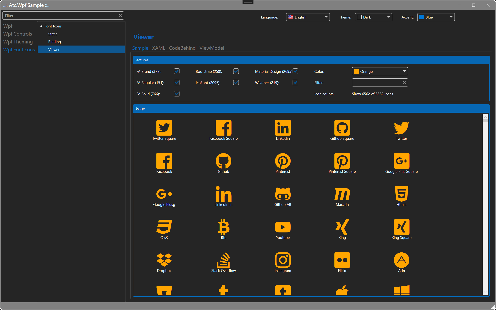        |

## How to get started with atc-wpf

First of all, include Nuget packages in the `.csproj` file like this:

```xml
  <ItemGroup>
    <PackageReference Include="Atc.Wpf" Version="2.0.178" />
    <PackageReference Include="Atc.Wpf.Controls" Version="2.0.178" />
    <PackageReference Include="Atc.Wpf.FontIcons" Version="2.0.178" />
    <PackageReference Include="Atc.Wpf.Theming" Version="2.0.178" />
  </ItemGroup>
```

Then update `App.xaml` like this:

```xml
<Application
    x:Class="Atc.Wpf.Sample.App"
    xmlns:atc="https://github.com/atc-net/atc-wpf/tree/main/schemas"
    [other namespaces]>
    <Application.Resources>
        <ResourceDictionary>

            <ResourceDictionary.MergedDictionaries>
                <ResourceDictionary Source="pack://application:,,,/Atc.Wpf.Theming;component/Styles/Default.xaml" />
                <ResourceDictionary Source="pack://application:,,,/Atc.Wpf.Controls;component/Styles/Controls.xaml" />
            </ResourceDictionary.MergedDictionaries>

        </ResourceDictionary>
    </Application.Resources>
</Application>
```

Now it is possible to use controls with theming and default WPF controls like TextBox, Button etc. with theme style.

## MVVM

The Windows Presentation Framework (WPF) takes full advantage of the Model-View-ViewModel (MVVM) pattern.

Therefore `Atc.Wpf` provide a good starting point for using MVVM.

| Tools set in the package | Description                                                                      |
|--------------------------|                                                                                  |
| ViewModelBase            | A base class for a the ViewModels                                                |
| MainWindowViewModelBase  | A base class for a the MainWindow-ViewModel                                      |
| ViewModelDialogBase      | A base class for a the Dialog-ViewModel                                          |
| ObservableObject         | A base class for a observable class that implement a PropertyChangedEventHandler |
| RelayCommand             | Command with `CanExecute`                                                        |
| RelayCommand{T}          | Command with `CanExecute`                                                        |
| RelayCommandAsync        | Command with `CanExecute` as async                                               |
| RelayCommandAsync{T}     | Command with `CanExecute` as async                                               |

## Translation

It is very easy to localize an application by binding text to a resource assembly that contains the text.
This is a standard .NET Globalization and localization way,
but just with a xaml-markup extension to lookup the value by key.

```xml
<!-- Add xmlns:atcTranslation to root element -->
<UserControl xmlns:atcTranslation="https://github.com/atc-net/atc-wpf/tree/main/schemas/translations">

<!-- Example on bind to a key in a resx-file with full namespace  -->
<TextBlock Text="{atcTranslation:Resx ResxName=Atc.Wpf.Sample.Resource.Word, Key=About}" />

<!-- Example on bind to a key in a resx-file with full namespace and apply a prefix and suffix  -->
<TextBlock Text="{atcTranslation:Resx ResxName=Atc.Wpf.Sample.Resource.Word, Key=About, Prefix='foo', Suffix='bar'}" />
```

## Media - ShaderEffects

| Type                          | Parameters and range values                                                 |
| ----------------------------- | --------------------------------------------------------------------------- |
| ContrastAdjustShaderEffect    | Brightness (-1.0 to 1.0 default 0.0) and Contrast (-1.0 to 1.0 default 0.0) |
| DesaturateShaderEffect        | Strength (0.0 to 1.0 default 0.0)                                           |
| FadeShaderEffect              | Strength (0.0 to 1.0 default 0.0) and Color (color)                         |
| InvertColorsShaderEffect      | None                                                                        |
| MonochromeShaderEffect        | Color (color)                                                               |
| SaturateShaderEffect          | Progress                                                                    |

## ValueConverters in Atc.Wpf

### ValueConverters - Bool to X

| Category                  | Type                                                     | Convert Examples                        | ConvertBack Examples                    |
| ------------------------- | -------------------------------------------------------- | --------------------------------------- | --------------------------------------- |
| Bool -> Bool              | BoolToInverseBoolValueConverter                          | True -> False and False -> True         | False -> True and False -> False        |
| Bool -> Visibility        | BoolToVisibilityCollapsedValueConverter                  | True -> Collapsed and False -> Visible  | Collapsed -> True and Visible -> False  |
| Bool -> Visibility        | BoolToVisibilityVisibleValueConverter                    | True -> Visible and False -> Collapsed  | Visible -> True and Collapsed -> False  |
| Bool -> With              | BoolToWidthValueConverter                                | true, 10 -> 10 and true, "Auto" -> *    | Not supported                           |
| Bool[] -> Bool            | MultiBoolToBoolValueConverter                            | All-True -> True                        | Not supported                           |
| Bool[] -> Visibility      | MultiBoolToVisibilityVisibleValueConverter               | All-True -> Visible                     | Not supported                           |

### ValueConverters - String to X

| Category                  | Type                                                     | Convert Examples                        | ConvertBack Examples                    |
| ------------------------- | -------------------------------------------------------- | --------------------------------------- | --------------------------------------- |
| String -> Brush           | ColorNameToBrushValueConverter                           | "Green" -> Brushs.Green                 | Brushs.Green -> "Green"                 |
| String -> Color           | ColorNameToColorValueConverter                           | "Green" -> Colors.Green                 | Colors.Green -> "Green"                 |
| String -> "NumericFormat" | StandardNumericFormatTypeToFormatStringValueConverter    | StandardNumericFormatType -> String     | Not supported                           |
| String -> Bool            | StringNullOrEmptyToBoolValueConverter                    | NULL or empty -> True                   | Not supported                           |
| String -> Bool            | StringNullOrEmptyToInverseBoolValueConverter             | NULL or empty -> False                  | Not supported                           |
| String -> Visibility      | StringNullOrEmptyToVisibilityCollapsedValueConverter     | NULL or empty -> Collapsed              | Not supported                           |
| String -> Visibility      | StringNullOrEmptyToVisibilityVisibleValueConverter       | NULL or empty -> Visible                | Not supported                           |
| String -> String          | ToLowerValueConverter                                    | String -> String                        | Binding.DoNothing                       |
| String -> String          | ToUpperValueConverter                                    | String -> String                        | Binding.DoNothing                       |

### ValueConverters - ICollection to X

| Category                  | Type                                                     | Convert Examples                        | ConvertBack Examples                    |
| ------------------------- | -------------------------------------------------------- | --------------------------------------- | --------------------------------------- |
| ICollection -> Bool       | CollectionNullOrEmptyToBoolValueConverter                | NULL or empty -> True                   | Not supported                           |
| ICollection -> Bool       | CollectionNullOrEmptyToInverseBoolValueConverter         | NULL or empty -> False                  | Not supported                           |
| ICollection -> Visibility | CollectionNullOrEmptyToVisibilityCollapsedValueConverter | NULL or empty -> Collapsed              | Not supported                           |
| ICollection -> Visibility | CollectionNullOrEmptyToVisibilityVisibleValueConverter   | NULL or empty -> Visible                | Not supported                           |

### ValueConverters - Object to X

| Category                  | Type                                                     | Convert Examples                        | ConvertBack Examples                    |
| ------------------------- | -------------------------------------------------------- | --------------------------------------- | --------------------------------------- |
| Object -> Bool            | IsNotNullValueConverter                                  | <>Null -> True and Null -> False        | Not supported                           |
| Object -> Bool            | IsNullValueConverter                                     | Null -> True and <>Null -> False        | Not supported                           |
| Null -> X                 | NullCheckValueConverter                                  | NULL -> Parameter if set                | Not supported                           |
| Null -> UnsetValue        | NullToUnsetValueConverter                                | NULL -> DependencyProperty.UnsetValue   | Object -> DependencyProperty.UnsetValue |
| Object -> Bool            | ObjectNotNullToBoolValueConverter                        | NotNULL -> True                         | Not supported                           |
| Object -> Visibility      | ObjectNotNullToVisibilityVisibleValueConverter           | NotNULL -> Visible                      | Not supported                           |
| Object -> Visibility      | ObjectNullToVisibilityCollapsedValueConverter            | NULL -> Collapsed                       | Not supported                           |
| Object[] -> Visibility    | MultiObjectNullToVisibilityCollapsedValueConverter       | All-NULL -> Collapsed                   | Not supported                           |
| Object -> Bool            | ObjectNullToBoolValueConverter                           | NULL => True                            | Not supported                           |


### ValueConverters - Markup to X

| Category                  | Type                                                     | Convert Examples                        | ConvertBack Examples                    |
| ------------------------- | -------------------------------------------------------- | --------------------------------------- | --------------------------------------- |
| Base converter            | MarkupMultiValueConverterBase                            | Base converter - no examples            | Base converter - no examples            |
|                           | MarkupValueConverter                                     |                                         |                                         |
|                           | MarkupValueConverterBase                                 |                                         |                                         |

### ValueConverters - Others to X

| Category                  | Type                                                     | Convert Examples                        | ConvertBack Examples                    |
| ------------------------- | -------------------------------------------------------- | --------------------------------------- | --------------------------------------- |
|                           | BackgroundToForegroundValueConverter                     |                                         |                                         |
| Brush -> Color            | BrushToColorValueConverter                               | Brushs.Green -> Colors.Green            | Colors.Green -> Brushs.Green            |
| Color -> Brush            | ColorToBrushValueConverter                               | Colors.Green -> Brushs.Green            | Brushs.Green -> Colors.Green            |
| Enum -> String            | EnumDescriptionToStringValueConverter                    | DayOfWeek.Monday -> Monday              | Not supported                           |
| Int -> Visibility         | IntegerGreaterThenZeroToVisibilityVisibleValueConverter  | 0 -> Collapsed and 1 -> Visible         | Not supported                           |
| Int -> TimeSpan           | IntegerToTimeSpanValueConverter                          | 100 -> TimeSpan.FromMilliseconds(100)   | Not supported                           |
| LogCategoryType -> Brush  | LogCategoryTypeToBrushValueConverter                     | Information -> Green                    | Not supported                           |
| LogCategoryType -> Color  | LogCategoryTypeToColorValueConverter                     | Information -> Green                    | Not supported                           |
|                           | ObservableDictionaryToDictionaryOfStringsValueConverter  |                                         |                                         |
|                           | ThicknessBindingValueConverter                           |                                         | DependencyProperty.UnsetValue           |
|                           | ThicknessFilterValueConverter                            |                                         | DependencyProperty.UnsetValue           |
|                           | ThicknessToDoubleValueConverter                          |                                         | DependencyProperty.UnsetValue           |
| Errors -> String          | ValidationErrorsToStringValueConverter                   |                                         | Not supported                           |
|                           | WindowResizeModeMinMaxButtonVisibilityMultiValueConverter|                                         |                                         |

### ValueConverters - Math

| Category                  | Type                                                     | Convert Examples                        | ConvertBack Examples                    |
| ------------------------- | -------------------------------------------------------- | --------------------------------------- | --------------------------------------- |
|                           | MathAddValueConverter                                    |                                         |                                         |
|                           | MathDivideValueConverter                                 |                                         |                                         |
|                           | MathMultiplyValueConverter                               |                                         |                                         |
|                           | MathSubtractValueConverter                               |                                         |                                         |
|                           | MathValueConverter                                       |                                         |                                         |

## ValueConverters in Atc.Wpf.FontIcons

| Category                  | Type                                                     | Convert Examples                        | ConvertBack Examples                    |
| ------------------------- | -------------------------------------------------------- | --------------------------------------- | --------------------------------------- |
| FontIcon -> DrawingImage  | FontIconDrawingImageValueConverter                       |                                         |                                         |
| FontIcon -> ImageSource   | FontIconImageSourceValueConverter                        |                                         |                                         |

## ValueConverters in Atc.Wpf.Theming

| Category                  | Type                                                     | Convert Examples                        | ConvertBack Examples                    |
| ------------------------- | -------------------------------------------------------- | --------------------------------------- | --------------------------------------- |
|                           | ColorToNameValueConverter                                |                                         | Not supported                           |
|                           | CornerRadiusBindingValueConverter                        |                                         | DependencyProperty.UnsetValue           |
|                           | CornerRadiusFilterValueConverter                         |                                         | DependencyProperty.UnsetValue           |
|                           | TreeViewMarginValueConverter                             |                                         | DependencyProperty.UnsetValue           |

## How to contribute

[Contribution Guidelines](https://atc-net.github.io/introduction/about-atc#how-to-contribute)

[Coding Guidelines](https://atc-net.github.io/introduction/about-atc#coding-guidelines)
